# Truck Track - GPS Fleet Tracking System


[](https://sonarcloud.io/summary/new_code?id=salimomrani_trucktrack)
[](https://sonarcloud.io/summary/new_code?id=salimomrani_trucktrack)
[](https://trucktrack-salims-projects-1bde5f7a.vercel.app)

**Live Demo:** https://trucktrack-salims-projects-1bde5f7a.vercel.app

Système de suivi GPS en temps réel pour la gestion de flottes de camions.

**Fonctionnalités principales :**
- Carte temps réel avec positions GPS live (WebSocket)
- Application mobile chauffeurs (iOS/Android) avec affichage des routes
- **Gestion des trajets** : création, assignation, suivi de statut
- Itinéraires routiers réels via OSRM (pas de lignes droites)
- Historique des trajets avec playback
- Geofences (zones géographiques) avec alertes entrée/sortie
- Alertes configurables (vitesse, offline, idle)
- Panel d'administration (utilisateurs, camions, groupes, trajets)
- Dashboard de monitoring (Prometheus/Grafana)

## Prérequis

| Outil | Version | Installation |
|-------|---------|--------------|
| Docker Desktop | 4.x+ | [docker.com/products/docker-desktop](https://www.docker.com/products/docker-desktop) |
| Java JDK | 17+ | `brew install openjdk@17` (macOS) |
| Maven | 3.9+ | `brew install maven` (macOS) |
| Node.js | 18+ | `brew install node` (macOS) |

**Pour le développement mobile (optionnel) :**
| Outil | Version | Installation |
|-------|---------|--------------|
| Android Studio | 2023+ | [developer.android.com/studio](https://developer.android.com/studio) |
| Xcode | 15+ | Mac App Store (macOS only) |

**Vérifier l'installation :**
```bash
docker --version    # Docker version 24.x+
java -version       # openjdk 17.x+
mvn -version        # Apache Maven 3.9+
node --version      # v18.x+
```

## Quick Start

```bash
# 1. Start Docker
open -a Docker  # macOS (attendre que Docker soit prêt)

# 2. Start backend (infrastructure + services)
./scripts/start-all.sh

# 3. Start frontend (nouveau terminal)
cd frontend && npm install && npm start
```

**Access:**
- Frontend Web: http://localhost:4200
- API Gateway: http://localhost:8000
- Login: `admin@trucktrack.com` / `AdminPass123!`

**Management:**
```bash
./scripts/stop-all.sh   # Stop backend
./scripts/status.sh     # Check status
```

**Mobile App (Expo):**
```bash
cd mobile-expo && npm install && npx expo start
# Scan QR code with Expo Go app
```

## Architecture

```mermaid
flowchart TB
    subgraph Clients["📱 Clients"]
        MOBILE["Mobile App<br/>React Native (Expo)<br/>iOS / Android"]
        WEB["Web Frontend<br/>Angular 21<br/>localhost:4200"]
    end

    subgraph Gateway["🔐 API Gateway :8000"]
        GW["JWT Validation • Routing • CORS"]
    end

    subgraph Services["⚙️ Microservices"]
        AUTH["Auth Service<br/>:8083<br/>Login, JWT, Users"]
        GPS["GPS Ingestion<br/>:8080<br/>Receive, Validate"]
        LOCATION["Location Service<br/>:8081<br/>Trucks, Trips, Geofences"]
        NOTIF["Notification<br/>:8082<br/>Alerts, WebSocket, Push"]
    end

    subgraph Messaging["📨 Event Streaming"]
        KAFKA["Kafka :9092<br/>gps.position | location.status | notification.alert"]
    end

    subgraph Data["💾 Data Layer"]
        PG["PostgreSQL + PostGIS<br/>:5432"]
        REDIS["Redis Cache<br/>:6379"]
    end

    subgraph Monitoring["📊 Observability"]
        PROM["Prometheus :9090"]
        GRAF["Grafana :3000"]
        JAEGER["Jaeger :16686"]
    end

    MOBILE --> GW
    WEB --> GW
    GW --> AUTH
    GW --> GPS
    GW --> LOCATION
    GW --> NOTIF

    GPS --> KAFKA
    LOCATION --> KAFKA
    KAFKA --> LOCATION
    KAFKA --> NOTIF

    AUTH --> PG
    AUTH --> REDIS
    LOCATION --> PG
    LOCATION --> REDIS
    NOTIF --> PG

    AUTH -.-> PROM
    LOCATION -.-> PROM
    GPS -.-> PROM
    NOTIF -.-> PROM
    PROM --> GRAF
```



**Flux de données GPS :**

```mermaid
sequenceDiagram
    participant Truck as 🚛 Camion
    participant GPS as GPS Ingestion
    participant Kafka as Kafka
    participant Location as Location Service
    participant DB as PostgreSQL
    participant WS as WebSocket
    participant Notif as Notification
    participant Mobile as 📱 Clients

    Truck->>GPS: GPS Position
    GPS->>Kafka: Publish event
    Kafka->>Location: Consume
    Location->>DB: Store position
    Location->>WS: Push update
    WS->>Mobile: Real-time position

    Kafka->>Notif: Consume
    Notif->>Notif: Check alert rules
    Notif->>Mobile: Push notification (if alert)
```



## Applications

| Application | Type | Technologie | Description |
|-------------|------|-------------|-------------|
| **Frontend Web** | Web | Angular 17 | Dashboard gestionnaire de flotte |
| **Mobile Expo** | iOS/Android | React Native + Expo | App chauffeurs avec GPS et routes |
| **Backend** | Microservices | Spring Boot 3.2 | API et services métier |

## Services Backend

| Service | Port | Description |
|---------|------|-------------|
| API Gateway | 8000 | Routing, auth, CORS |
| Auth | 8083 | JWT, users, groups |
| GPS Ingestion | 8080 | GPS data intake |
| Location | 8081 | Trucks, trips, history, WebSocket |
| Notification | 8082 | Alerts, FCM push |

## Monitoring

| Tool | URL | Credentials |
|------|-----|-------------|
| Grafana | http://localhost:3000 | admin / admin |
| Prometheus | http://localhost:9090 | - |
| Jaeger | http://localhost:16686 | - |
| Kafka UI | http://localhost:8088 | - |

## Development

### Backend
```bash
cd infra/docker && docker-compose up -d
cd backend && mvn clean install -DskipTests
cd backend/<service> && mvn spring-boot:run
```

### Frontend Web
```bash
cd frontend && npm install && npm start
```

### Mobile App (Expo)
```bash
cd mobile-expo && npm install
npx expo start
# Scanner le QR code avec Expo Go (Android/iOS)
```

## Project Structure

```
truck-track/
├── backend/                    # Java microservices
│   ├── api-gateway/           # :8000 - Routing & auth
│   ├── auth-service/          # :8083 - Authentication
│   ├── gps-ingestion-service/ # :8080 - GPS intake
│   ├── location-service/      # :8081 - Trucks, trips & history
│   ├── notification-service/  # :8082 - Alerts
│   └── shared/                # Common DTOs & utils
├── frontend/                   # Angular web app
│   └── src/app/
│       ├── core/              # Services, guards
│       ├── features/          # Map, history, alerts
│       └── admin/             # Users, trucks, trips
├── mobile-expo/                # Expo mobile app
│   └── src/
│       ├── screens/           # Map, Trips, Home
│       ├── services/          # API, GPS, notifications
│       └── store/             # Zustand state
├── scripts/                    # Start/stop scripts
├── infra/                      # Docker configs
└── specs/                      # Feature specifications
```

## Documentation

- [Backend](backend/README.md) - Microservices architecture
- [Frontend](frontend/README.md) - Angular web app
- [Mobile](mobile-expo/README.md) - Expo driver app
- [ER Diagram](docs/database-er-diagram.md) - Database schema
- [Architecture](docs/architecture-diagram.md) - System architecture details

## Troubleshooting

| Problem | Solution |
|---------|----------|
| Docker not running | `open -a Docker` |
| Port in use | `lsof -i :8080` then `kill -9 <PID>` |
| Services won't start | `./stop-all.sh && ./start-all.sh --build` |
| Mobile build fails | Check Android SDK / Xcode installation |
