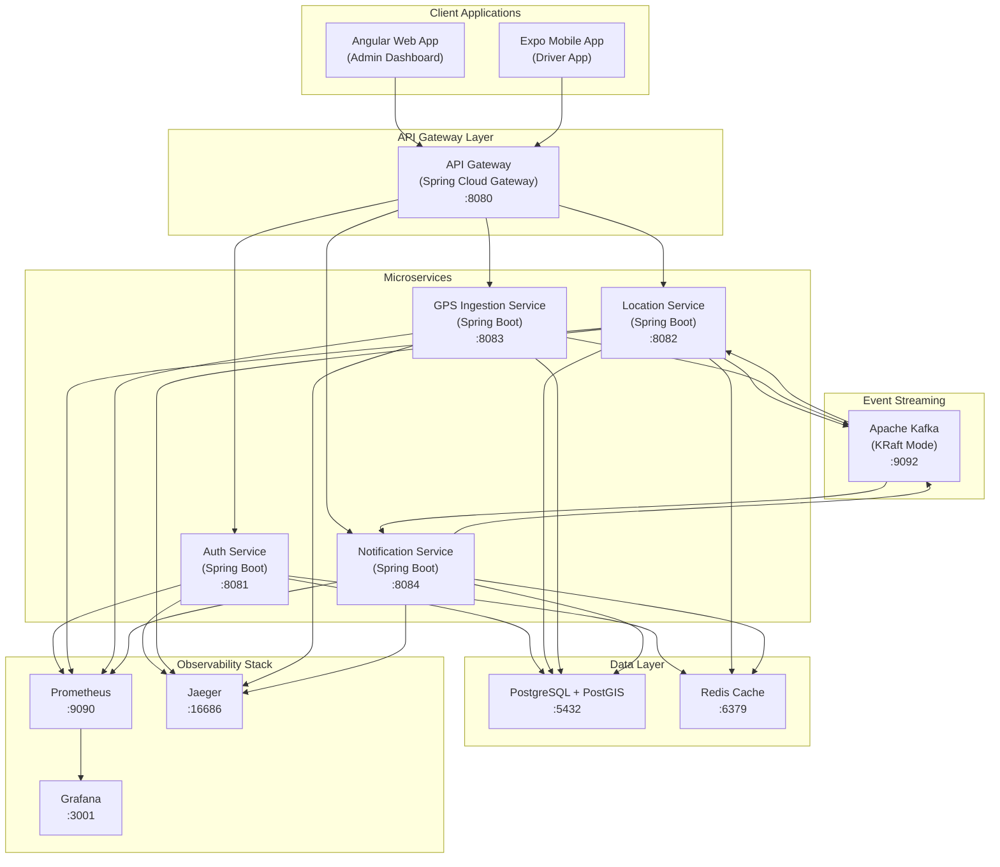
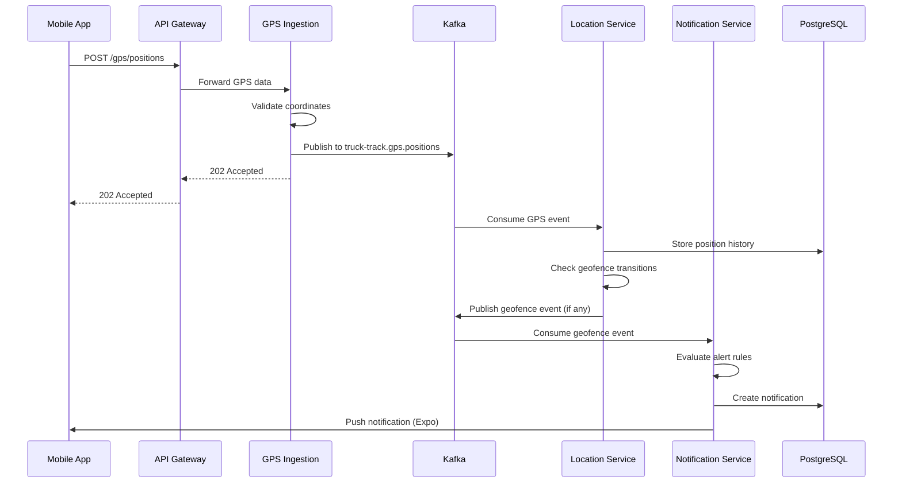
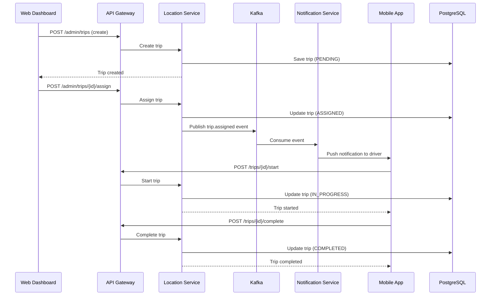
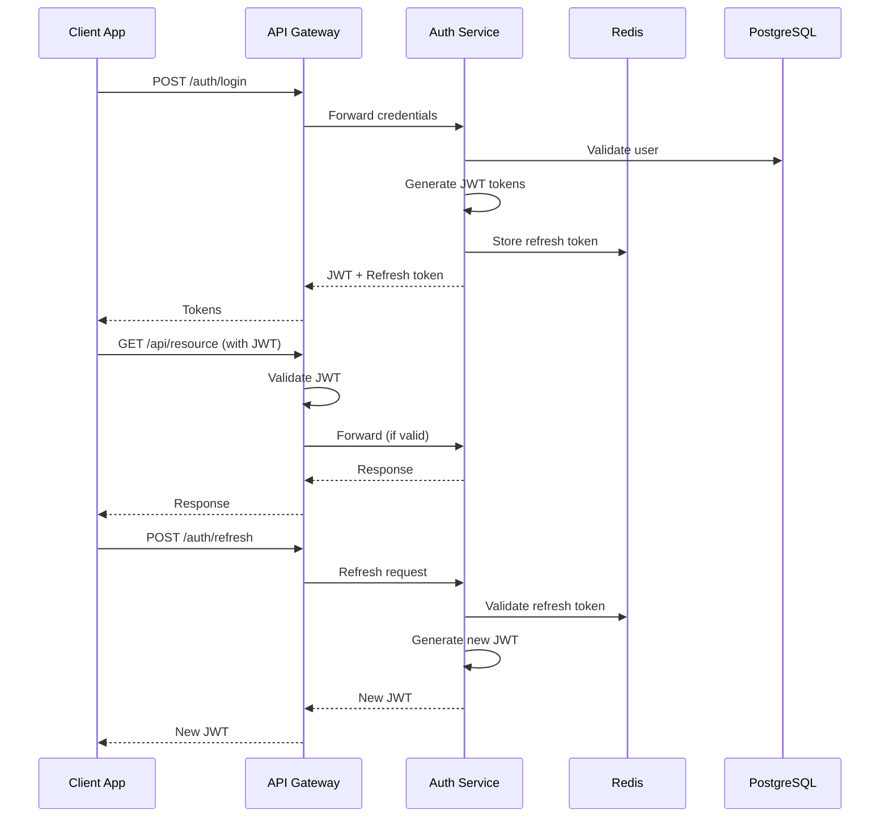
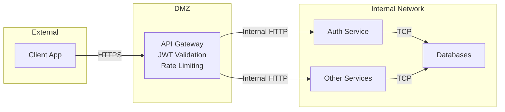

# TruckTrack System Architecture

## Overview

TruckTrack is a GPS fleet management system built on a microservices architecture. This document describes the system components and their interactions.

## High-Level Architecture



## Component Details

### Client Applications

| Component | Technology | Description |
|-----------|------------|-------------|
| **Web Dashboard** | Angular 21, Material UI, NgRx | Admin interface for fleet managers and dispatchers |
| **Mobile App** | React Native (Expo) | Driver app for trip management and GPS tracking |

### API Gateway

| Component | Technology | Port | Description |
|-----------|------------|------|-------------|
| **API Gateway** | Spring Cloud Gateway | 8080 | Central entry point, routing, JWT validation, rate limiting |

### Microservices

| Service | Technology | Port | Responsibilities |
|---------|------------|------|------------------|
| **Auth Service** | Spring Boot 3.2 | 8081 | User authentication, JWT tokens, RBAC, user management |
| **Location Service** | Spring Boot 3.2 | 8082 | Truck tracking, trips, geofences, fleet analytics |
| **GPS Ingestion** | Spring Boot 3.2 | 8083 | High-throughput GPS data ingestion, validation, Kafka publishing |
| **Notification Service** | Spring Boot 3.2 | 8084 | Alert rules, notifications, WebSocket push, Expo push notifications |

### Data Layer

| Component | Technology | Port | Purpose |
|-----------|------------|------|---------|
| **PostgreSQL** | PostgreSQL 15 + PostGIS | 5432 | Primary database with geospatial extensions |
| **Redis** | Redis 7 | 6379 | Session cache, rate limiting, real-time data cache |

### Event Streaming

| Component | Technology | Port | Purpose |
|-----------|------------|------|---------|
| **Kafka** | Apache Kafka (KRaft) | 9092 | Async messaging for GPS events, notifications, inter-service communication |

### Observability

| Component | Technology | Port | Purpose |
|-----------|------------|------|---------|
| **Prometheus** | Prometheus | 9090 | Metrics collection and storage |
| **Grafana** | Grafana | 3001 | Metrics visualization and dashboards |
| **Jaeger** | Jaeger | 16686 | Distributed tracing |

## Data Flow Diagrams

### GPS Tracking Flow



### Trip Lifecycle Flow



### Authentication Flow



## Kafka Topics

| Topic | Producer | Consumer(s) | Description |
|-------|----------|-------------|-------------|
| `truck-track.gps.positions` | GPS Ingestion | Location Service | Real-time GPS position updates |
| `truck-track.geofence.events` | Location Service | Notification Service | Geofence entry/exit events |
| `truck-track.trips.assigned` | Location Service | Notification Service | Trip assignment notifications |
| `truck-track.trips.updated` | Location Service | Notification Service | Trip status change events |
| `truck-track.alerts` | Notification Service | - | Generated alerts for analytics |

## Security Architecture



### Security Features

- **JWT Authentication**: Stateless token-based authentication
- **Role-Based Access Control**: ADMIN, FLEET_MANAGER, DISPATCHER, DRIVER roles
- **Rate Limiting**: API Gateway level protection against abuse
- **CORS Configuration**: Strict origin validation
- **Password Hashing**: BCrypt with configurable strength
- **Refresh Token Rotation**: Secure token refresh mechanism

## Deployment

### Docker Compose (Development)

All services are containerized and can be started with:
```bash
cd infra/docker
docker-compose up -d
```

### Production Recommendations

- Kubernetes deployment with Helm charts
- Managed PostgreSQL (RDS, Cloud SQL)
- Managed Redis (ElastiCache, Memorystore)
- Managed Kafka (MSK, Confluent Cloud)
- Load balancer in front of API Gateway
- Auto-scaling for microservices
