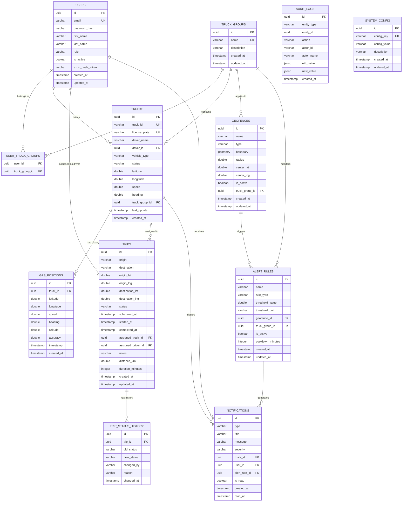

# TruckTrack Database Entity Relationship Diagram

## Overview

This document describes the database schema for the TruckTrack fleet management system.

## ER Diagram

## Entity Descriptions

### Auth Service

| Entity | Description |
|--------|-------------|
| **USERS** | System users (admins, fleet managers, dispatchers, drivers) |
| **USER_TRUCK_GROUPS** | Many-to-many relationship between users and truck groups |

### Location Service

| Entity | Description |
|--------|-------------|
| **TRUCKS** | Fleet vehicles with real-time position and status |
| **TRUCK_GROUPS** | Logical grouping of trucks (by region, type, etc.) |
| **GPS_POSITIONS** | Historical GPS position data for trucks |
| **TRIPS** | Trip records with origin/destination and assignment |
| **TRIP_STATUS_HISTORY** | Audit trail of trip status changes |
| **GEOFENCES** | Geographic boundaries for monitoring |

### Notification Service

| Entity | Description |
|--------|-------------|
| **ALERT_RULES** | Configurable rules for generating alerts |
| **NOTIFICATIONS** | Alert notifications sent to users |
| **AUDIT_LOGS** | System-wide audit trail |
| **SYSTEM_CONFIG** | Application configuration settings |

## Status Enumerations

### Truck Status
- `ACTIVE` - Truck is operational and tracking
- `INACTIVE` - Truck is not in use
- `MAINTENANCE` - Truck is under maintenance
- `OFFLINE` - No GPS signal received

### Trip Status
- `PENDING` - Trip created, not assigned
- `ASSIGNED` - Trip assigned to truck/driver
- `IN_PROGRESS` - Trip started by driver
- `COMPLETED` - Trip successfully completed
- `CANCELLED` - Trip cancelled

### User Roles
- `ADMIN` - Full system access
- `FLEET_MANAGER` - Manage fleet and view analytics
- `DISPATCHER` - Manage trips and assignments
- `DRIVER` - Mobile app access, trip operations

### Alert Rule Types
- `SPEED_LIMIT` - Speed threshold exceeded
- `GEOFENCE_ENTER` - Truck entered geofence
- `GEOFENCE_EXIT` - Truck exited geofence
- `IDLE_TIME` - Truck idle too long
- `OFFLINE` - Truck lost connectivity
